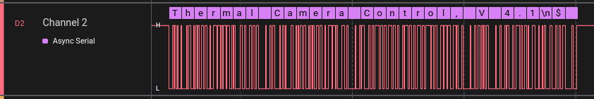

# re-intercept-board-comms

## Authors
- Tiago Silvestre
- David Araújo

## Tools used
- Pulseview
- pterm

## Introduction

## Binary analysis

## I2C
We started by analyzing I2C communications in both pins 5 and 6.

With pulse view opened and channels 0 and 1 configured to read signals from pin 5 and 6 we got the following result.

In our case channel 0 represents the pin 6 and pin 1 reads signals from ping 5. 

We can't see any differences between both signals because the resolution is too low. So, we did some zoom to have the same order of magnitude of the signal.

The clock is present in channel 0 because it's signal is more uniform when compared with channel 1.

We found that the signal period was around 5us (200kHz).

A I2C decoder was applied given that channel 0 was dedicated to SDK and channel 1 to SDA.

Now to interpret the I2C messaged that are being captured, we can see that the master is writting in 0x48 (72) and 0x4c (76) the value 0. After each write operation, a read operation is followed for the same address.

The value that is read is the same as the left and right temperature sensors. So, we assume that both 0x4c and 0x48 are the I2C addresses of the temperature sensors.

## RS232
We also intercepted messages from RS232 signals, the same procedure was done as I2C (pulse view, connecting the pins accordingly, ...).

When we applied RS232 decoder from pulseview the program detected some corrupted frames (bad parity, etc ...) so we had to do some trial and error until we discoreved the configuration that worked for the signal.

To discover the baudrate we picked the smallest period (104us) that we found and calculated the baudrate dividing 1e6 / 104 which resulted ~9615 which is closer for 9600 standard baud rate value for this protocol.

We were not finding anything until we pressed reset button which revealed the following string.

Allowing us to guarantee that the configuration is set up correctly and to continue exploring.
