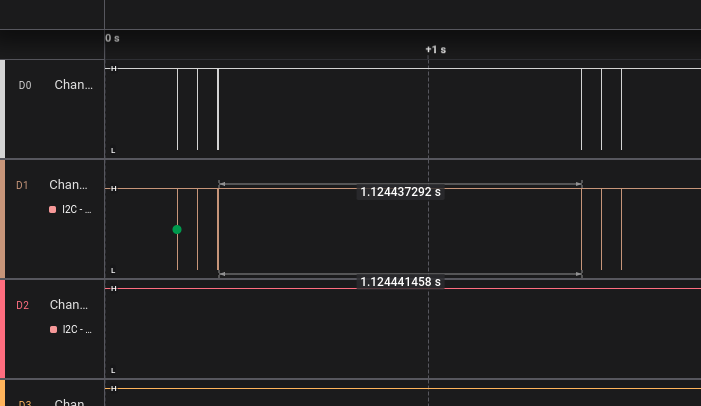
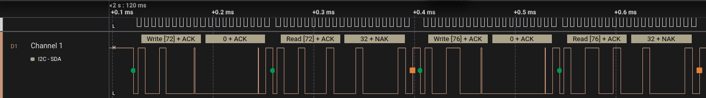
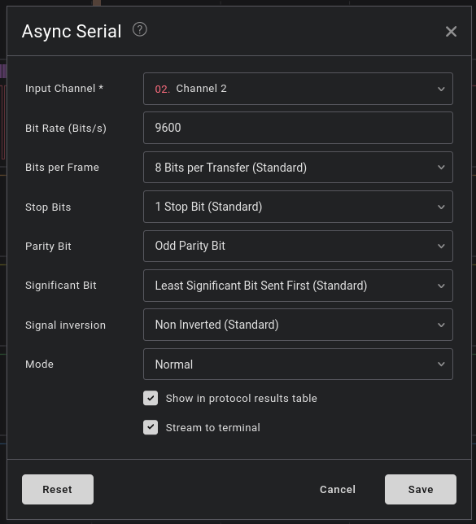
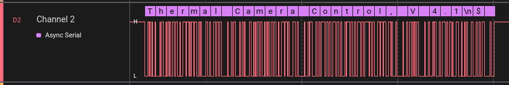
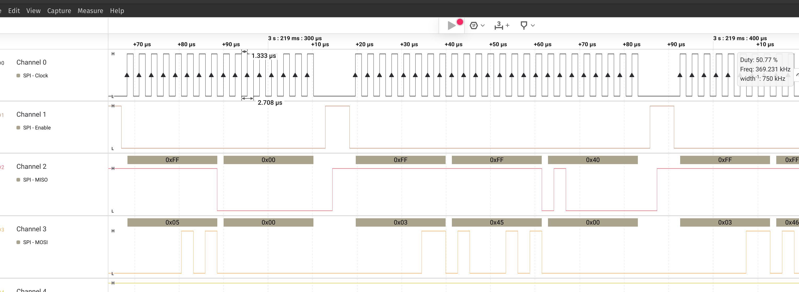
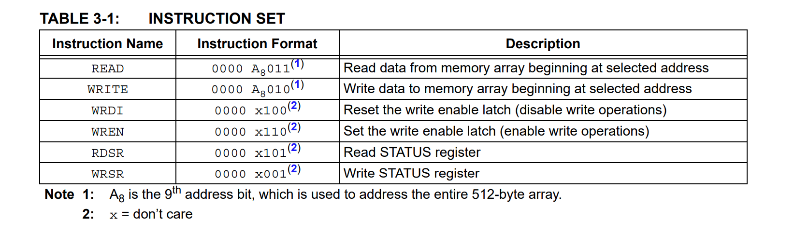
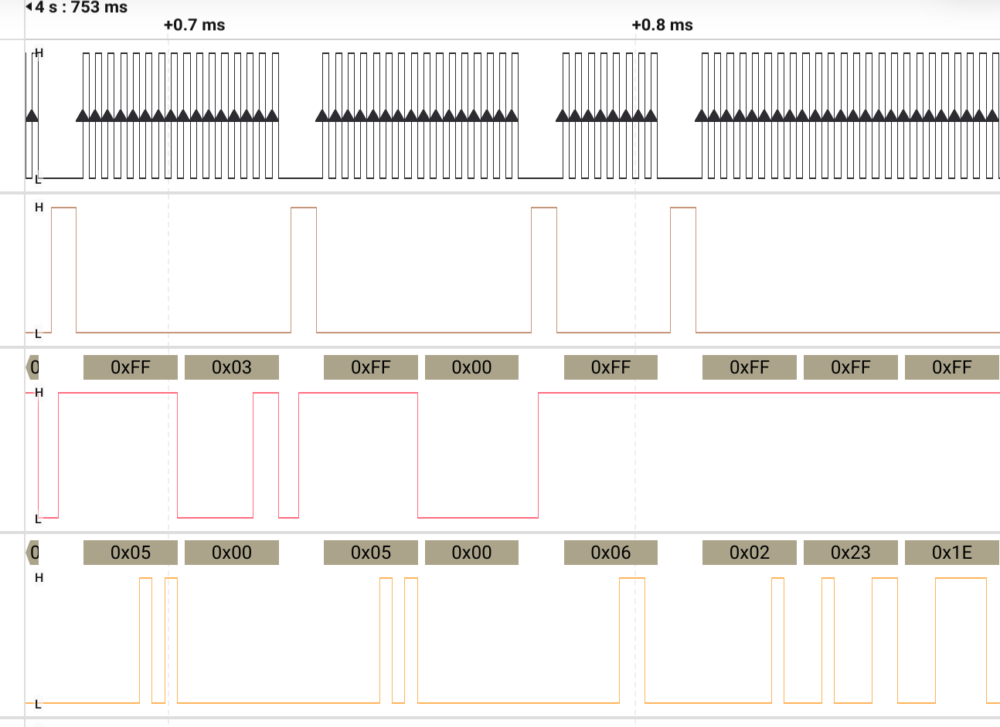

# re-intercept-board-comms

## Authors
- Tiago Silvestre
- David Araújo

## Tools used
- Pulseview
- pterm

## Introduction

## Binaries static analysis

## I2C
We started by analyzing I2C communications in both pins 5 and 6.

With pulse view opened and channels 0 and 1 configured to read signals from pin 5 and 6 we got the following result.

In our case channel 0 represents the pin 6 and pin 1 reads signals from ping 5. 

We can't see any differences between both signals because the resolution is too low. So, we did some zoom to have the same order of magnitude of the signal.

The clock is present in channel 0 because it's signal is more uniform when compared with channel 1.

We found that the signal period was around 5us (200kHz).

A I2C decoder was applied given that channel 0 was dedicated to SDK and channel 1 to SDA.

Now to interpret the I2C messaged that are being captured, we can see that the master is writting in 0x48 (72) and 0x4c (76) the value 0. After each write operation, a read operation is followed for the same address.

The value that is read is the same as the left and right temperature sensors. So, we assume that both 0x4c and 0x48 are the I2C addresses of the temperature sensors.

## RS232
We also intercepted messages from RS232 signals, the same procedure was done as I2C (pulse view, connecting the pins accordingly, ...).

When we applied RS232 decoder from pulseview the program detected some corrupted frames (bad parity, etc ...) so we had to do some trial and error until we discoreved the configuration that worked for the signal.

To discover the baudrate we picked the smallest period (104us) that we found and calculated the baudrate dividing 1e6 / 104 which resulted ~9615 which is closer for 9600 standard baud rate value for this protocol.

We were not finding anything until we pressed reset button which revealed the following string.

Allowing us to guarantee that the configuration is set up correctly and to continue exploring.

## SPI
We also analyzed SPI protocol, at first tries we were not able to find anything relevant because the frequency of capture was set too low. After checking the memory chip documentation (MICROCHIP 25LC040A), we found that the frequency was in the order of MHZ so we did a capture with 24Mhz. After that the capture seemed to be correct because the clock signal was stable.

To identify the clock signal, we choose the signal that had a duty cycle of 50% and behaved like a clock.
The clock period of the clock is ~2.7us which results in a frequency of ~369kHz.

The logic to identify chip select signal was to find the signal that was up when clock was disabled and was down when other signals were changing.

The last two signals MOSI and MISO were harder to identify, but we found two conclusions to support our argument.

1. Due the protocl being a master slave one, a communication should start by having master requesting data to the slave (memory chip). Which means that the first signal that changes should be the master (MOSI). In our case is the channel 3.

2. The CHIP [documentation](https://ww1.microchip.com/downloads/aemDocuments/documents/MPD/ProductDocuments/DataSheets/25AA040A-25LC040A4-Kbit-SPI-Bus-Serial-EEPROM-20001827J.pdf) reveals the instruction set and how a write sequence is done (in section 3.3). Reading how write works, we found that MOSI signal must be the channel 3 because we found a write sequence in this channel, it should start with 0x06 and then setting chip select to high and low, after that the master sends 0x02 and the address and value that should be written memory with additional two bytes. This sequence was not found in the remaining channels.

